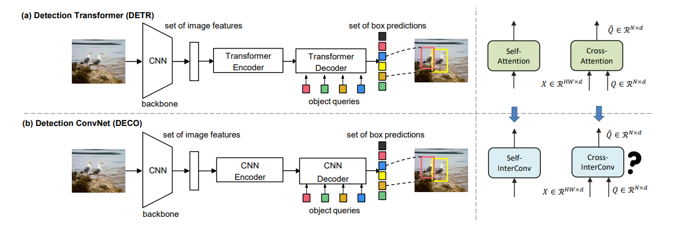

# DECO: A Convolution-Based DETR Variant

**Unofficial Implementation of ICLR 2025 Paper**:  
**UNLEASHING THE POTENTIAL OF CONVNETS FOR QUERY-BASED DETECTION AND SEGMENTATION**  
[📄 Read on OpenReview](https://openreview.net/forum?id=TWRhLAN5rz)  
🔎 Also available on [ArXiv](https://arxiv.org/abs/2312.13735)

**Authors**: Xinghao Chen, Siwei Li, Yijing Yang, Yunhe Wang

---

## Overview

This repository contains an **unofficial PyTorch implementation** of **DECO**, a DETR-like object detection framework described in the paper **"UNLEASHING THE POTENTIAL OF CONVNETS FOR QUERY-BASED DETECTION AND SEGMENTATION"** where the standard self-attention and cross-attention are replaced by purely convolutional modules (InterConv). Our goal is to replicate the main ideas from the paper and provide an easy-to-run codebase for further research.

 --- 

## Features
- Replaces attention with:
  - Self-Interaction Module (SIM)
  - Cross-Interaction Module (CIM)
- Compatible with standard backbones like ResNet18.
- Uses Hungarian matching and the set-based loss from DETR.
- Reasonable training speed and memory usage on a single RTX 2080. (We hope at least haha :D)

---

## Getting Started

[Under construction].