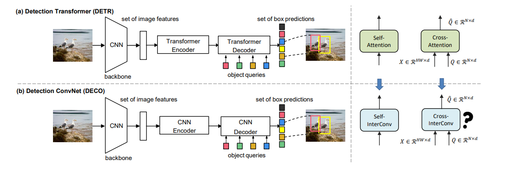

# DECO: Convolution-Based Object Detection

Unofficial PyTorch implementation of [DECO](https://openreview.net/forum?id=TWRhLAN5rz) (ICLR 2025), a DETR variant that replaces Transformer attention with convolutional modules for object detection.

<p align="center">

</p>

## Key Idea

DECO demonstrates that query-based object detection doesn't require attention mechanisms. Instead, it uses:

- **Self-Interaction Module (SIM)**: Depthwise convolutions to model relationships among object queries
- **Cross-Interaction Module (CIM)**: Convolutional fusion between queries and encoded image features

This results in competitive detection performance with improved efficiency over attention-based models.

## Architecture

```
Image (B, 3, H, W)
    │
    ▼
┌─────────────────────┐
│  ResNet18 Backbone  │  Pretrained feature extraction
└─────────────────────┘
    │ (B, 512, H/32, W/32)
    ▼
┌─────────────────────┐
│   DECO Encoder      │  3 ConvNeXt-style layers
│   (DWConv 7×7)      │  Projects to 256 channels
└─────────────────────┘
    │ (B, 256, H/32, W/32)
    ▼
┌─────────────────────┐
│   DECO Decoder      │  6 layers with SIM + CIM
│   100 queries       │  Queries as 10×10 spatial grid
│   (DWConv 9×9)      │
└─────────────────────┘
    │
    ▼
┌─────────────────────┐
│  Prediction Heads   │  Classification (80 classes)
│                     │  Box regression (4 coords)
└─────────────────────┘
```

## Installation

```bash
git clone https://github.com/h4tem/DECO.git
cd DECO
pip install torch torchvision scipy pycocotools
```

## Dataset Setup

### COCO 2017 (Full Training)

```bash
mkdir -p data/train2017 data/annotations

# Download from https://cocodataset.org/#download
# Extract train2017.zip → data/train2017/
# Extract annotations_trainval2017.zip → data/annotations/
```

### Tiny Dataset (Quick Testing)

```bash
python scripts/create_tiny_dataset.py
# Creates synthetic data in data/tiny_coco/
```

## Usage

### Training

```bash
python scripts/train.py
```

Training configuration (in `scripts/train.py`):
- **Optimizer**: AdamW with differential learning rates (backbone: 1e-5, other: 1e-4)
- **Scheduler**: StepLR (step=20, gamma=0.1)
- **Epochs**: 100
- **Batch size**: 2 (fits on 8GB GPU)
- **Loss weights**: CE=2.0, L1=5.0, GIoU=2.0

Checkpoints are saved to `outputs/`.

### Demo

```bash
python scripts/demo.py
# Visualizes data loading and model forward pass
# Outputs to outputs/demo_img_*.png
```

## Project Structure

```
DECO/
├── models/
│   ├── deco_model.py          # Full model wrapper
│   ├── backbone/
│   │   └── resnet18.py        # ResNet18 feature extractor
│   ├── encoder/
│   │   └── deco_encoder.py    # ConvNeXt-style encoder
│   └── decoder/
│       ├── deco_decoder.py    # Query-based decoder
│       └── modules.py         # SIM, CIM, MLP modules
├── utils/
│   ├── criterion.py           # DETR-style losses
│   ├── matcher.py             # Hungarian matching
│   └── data_utils.py          # COCO dataset & transforms
└── scripts/
    ├── train.py               # Training loop
    ├── demo.py                # Visualization demo
    └── create_tiny_dataset.py # Generate test data
```

## Implementation Details

| Component | Configuration |
|-----------|--------------|
| Backbone | ResNet18 (ImageNet pretrained) |
| Encoder layers | 3 |
| Decoder layers | 6 |
| Hidden dimension | 256 |
| Object queries | 100 (10×10 grid) |
| Encoder kernel | 7×7 depthwise |
| Decoder kernel | 9×9 depthwise |

The decoder reshapes 100 queries into a 10×10 spatial grid, enabling convolutional processing. Hungarian matching assigns predictions to ground truth for loss computation.

## References

```bibtex
@inproceedings{chen2025deco,
  title={Unleashing the Potential of ConvNets for Query-Based Detection and Segmentation},
  author={Chen, Xinghao and Li, Siwei and Yang, Yijing and Wang, Yunhe},
  booktitle={ICLR},
  year={2025}
}
```

Paper: [OpenReview](https://openreview.net/forum?id=TWRhLAN5rz) | [ArXiv](https://arxiv.org/abs/2312.13735)
